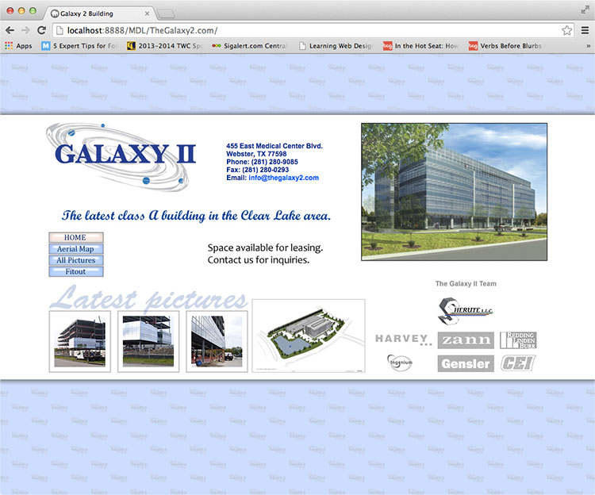
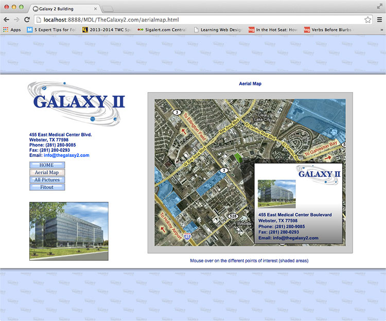
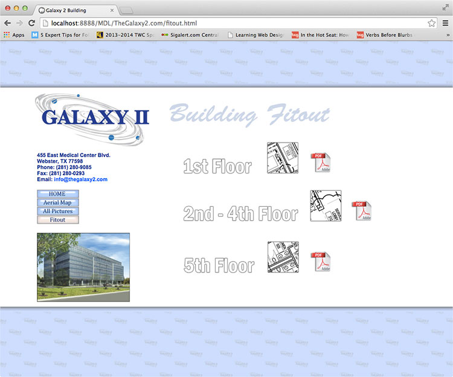

  
`thegalaxy2.com`  

# Dates:  
2005 - 2008  
# Technologies:  
HTML4, CSS, Flash
# Description:  
This website was meant to give information to prospective tenants of this new building. It showed floor plans, geographic location of the surrounding area and updated pictures of the construction progress.  

I oversaw the full development cycle of this project from design, coding, to maintenance.  
# Screenshots:
  
  
  
